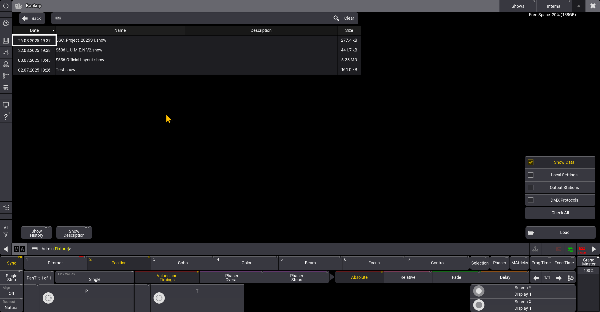

# Introduction
In this .md, you will learn how to load a GrandMA3 showfile internally on a GrandMA3 OnPC Windows

## Pre-Checks
1. You have a .SHOW file
2. GrandMA3 OnPC (Windows)
## Instructions
### Windows:

1. Open File Explorer
2. Locate ***ProgramData*** in your Windows (:C)   
    2.1. If you are unable to locate, do the following:
    
    2.2 At the top of *File Explorer*, <u>Click on View > Show > Enable Hidden Items</u>
3. Navigate to <u>MALightingTechnology > gma3_2.2.5 > shared > shows</u>
4. Paste your .SHOW file in this folder

### GrandMA3 OnPC:
1. Navigate to Backup. Refer to the image below

2. Click Load   
3. Your .SHOW file that you pasted should appear here

## Extras
Select your dependencies and Load.
