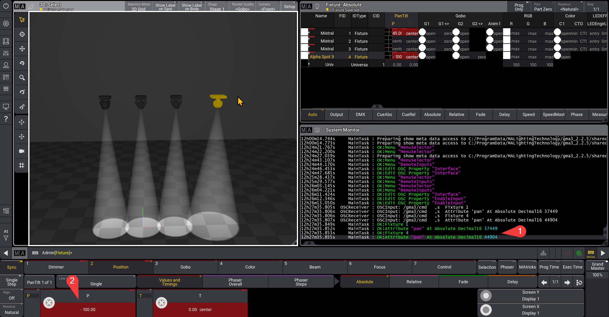
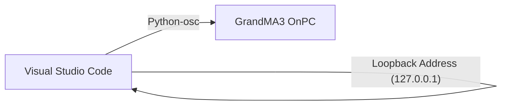

# syak-OSC
This repo is to document my **Python Open Sound Control (OSC)** research for ***GrandMA3***. 

This research was conducted on
1. GrandMA3 OnPC 2.2.5.2 (Windows)
2. Visual Studio Code 1.99.3 (Windows)

## Introduction
In this repo, you'll find out how to control **Pan & Tilt** attributes. [GMA3_OSC.py](GMA3_OSC.py) is a python script that you <u>edit and execute</u> in order to adjust *Pan & Tilt* attributes in **GrandMA3**. 

## Getting Ready
### 1. Visual Studio Code Terminal
1. Copy *[GMA3_OSC.py](GMA3_OSC.py)* into your **VSC**

2. Identify that you have installed *python* on your **Visual Studio Code (VSC)**. Type the following command in your **VSC Terminal**. If it shows something like python *3.x.x*, then python is installed.
#### Check if python is installed
```
py --version
```
#### If not, please install python on your **VSC**

3. Install python-osc
```
py -m pip install python-osc
```
### 2. GrandMA3
1. Load the [GrandMA3 Show file](OSC_Project_2025S1.show). 
Refer [Here](LoadShow.md) to know how to Load internally (Windows)

2. Here we will configure the ***In & Out*** settings in order for **OSC** to work. Follow the steps shown in the images.


## Testing
1. Once you have set up **VSC** and **GMA3**. Test with the following.
2. Run the python file in the terminal with this text
```
py GMA3_OSC.py
```
3. After running the code. You will see feedback in the System Monitor (1). You can also check in the attributes (2) 

# System Flowchart
This flowchart explains how we are able to communicate internally through both programmes.

