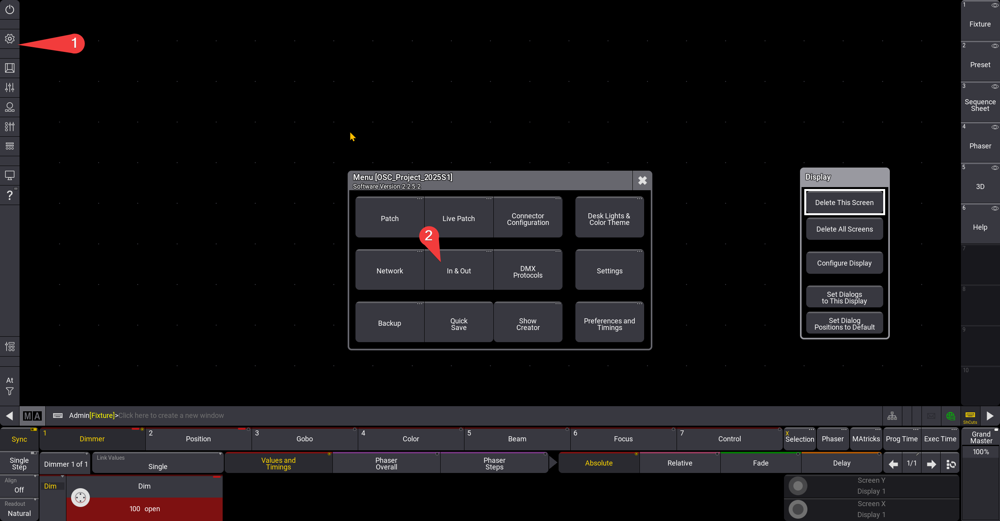
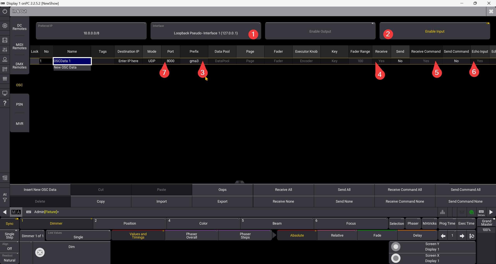
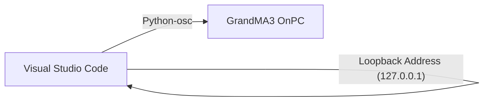

# syak-OSC
This repo is to document my **Python Open Sound Control (OSC)** research for ***GrandMA3***. In this repo, you'll find out how to control **Pan & Tilt** attributes.

## Dependencies
This research was conducted on
1. GrandMA3 OnPC 2.2.5.2
2. Visual Studio Code 1.99.3

## Getting Ready
### Visual Studio Code Terminal
1. Copy *[GMA3_OSC.py](GMA3_OSC.py)*

2. Identify that you have installed *python* on your **Visual Studio Code (VSC)**. Type the following command in your **VSC Terminal**. If it shows something like python *3.x.x*, then python is installed.
```
py --version
```
If not, please install python on your **VSC**

3. Install python-osc
```
py -m pip install python-osc
```
### GrandMA3
1. Load the [GrandMA3 Show file](OSC_Project_2025S1.show). 

2. Here we will configure the ***In & Out*** settings in order for **OSC** to work. Follow the steps shown in the images.


## Testing
1. Open System Monitor

# System Flowchart
This flowchart explains how we are able to communicate internally through both programmes.

